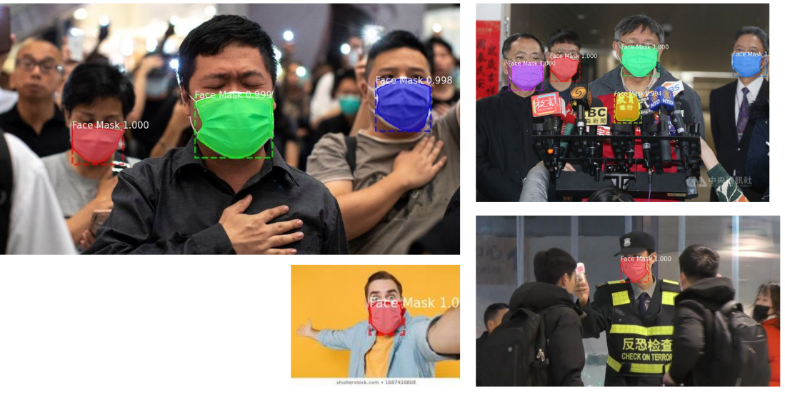

# FaceMask-RCNN

This repo demonstrates how you can build your own face mask detection mask-rcnn and set up a simple Flask webserver
to run inference on real world images.

What we want to achieve:



# Step 1: Training the Model

View [Step_1_Working_Process.md](Step_1_Working_Process.md) for steps taken while working for this step.

### How to Fine-Tune Mask RCNN with Annotated Face Mask Dataset
* Download annotated dataset. [Link](https://drive.google.com/file/d/1b-G3QmwC0JtlfI6IKsSjw3K3xGxWHLJo/view)
* Unzip the directory and place the `dataset` folder (which should contain `train` and `val`) .
* Create a conda environment: `conda create -n face_mask python=3.7`.
* Activate conda environment: `conda activate face_mask`
* Install requirements: `pip install -r requirements.txt`.
* Training: `python train.py --dataset /path/where/you/downloaded/dataset --weights "coco" --training_type "heads" --epochs 5`.
* Fine tuning: `python train.py --dataset /path/where/you/downloaded/dataset --weights "last" --training_type "all" --epochs 10`.

### Running Evaluation Script
* Download trained weights: [link](https://drive.google.com/file/d/1qjAJwsS6Rx2niTIVbak24oKlLitPWZU-/view?usp=sharing)
* `python eval.py --dataset /path/where/you/downloaded/dataset --weights "/path/to/weight/file" --device "cpu"`

### Training steps, validation and testing
* You can take a look at `Step_1_Retrain_Mask_RCNN.ipynb` for training setps,
validation and testing on unseen images.

# Step 2: Simple AI API

Simple Flask webserver which uses Mask RCNN trained to detect and segment face masks in images.

### Preparation
* Download weights file: [link](https://drive.google.com/file/d/1qjAJwsS6Rx2niTIVbak24oKlLitPWZU-/view?usp=sharing)

### How to Run
* If you haven't created a conda environment in Step 1, create conda environment: `conda create -n face_mask python=3.7`
* Activate environment: `conda activate face_mask`
* Install required libraries: `pip install -r requirements.txt`
* Start webserver: `python webserver.py --weights </path/to/downloaded/weight/file> --device [cpu|gpu]`
* For local deployment, go to `http://127.0.0.1:5000/`
    * Navigate to `/upload` and upload an image.
        * You will receive a JSON response which includes the URL of the image.
        * Go to that URL to download the result image.
    * Alternatively, you can try out with cURL
        ```shell script
            curl --location --request POST 'http://localhost:5000/upload' --form 'file=@/path/to/image.jpg'
        ``` 

Sample JSON response:
```json
{
  "output":"http://localhost:5000/results/output_image.jpg",
  "percent_masked":1.8,
  "success":true
}
```

*Browser caching*: Normally, when you access the image URL, the browser should download the result image. 
But some browsers open a new tab to show the image. Sometimes, you may see 
cached result image from previous API call. If that's the case, clear cache and refresh by "Ctrl+Shift+R".