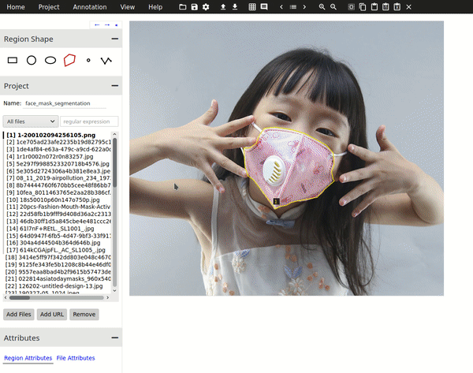

## Task 1. Retrain the model

**Game plan**
 * Get Matterport's Mask-RCNN code running in CoLab. 
    * I figure there would be some problem with
Tensorflow and Keras. Turns out CoLab just loads tensorflow 2.x and [Matterport's Code](https://github.com/matterport/Mask_RCNN) 
would need some tweaks to make it work (solution: add magic cell `%tensorflow_version 1.x` before tensorflow 
is loaded). Keras has its own problem with appending loss. Fix that issue in `model.py`.
* Get data to work on.
    * Annotate data if required.
* Using Matterport's codebase, start with a pretrained Mask RCNN on COCO.
    * Fine tune the network for new data set.

### Getting Data

I want to build a Mask RCNN model which can segment face masks (the protective ones -- not the
one you would wear on Halloween, but wait, I think this halloween, people would be wearing both too).

- Questions: Is there a face mask dataset with segmentation masks which I can easily use?
    * If not, then, is there a dataset with faces with face masks (not necessarily with annotations --
    very likely). Draw masks with [VIA](http://www.robots.ox.ac.uk/~vgg/software/via/via.html).
    * If I cannot find one (very unlikely), I am going to use one of the image searches to crawl for some face mask images and
     draw segmentation masks with VIA.
- Normally, what I do is conduct some literature review and check what other people 
have done in the field. Tools I use: google scholar, [connectedpapers](https://www.connectedpapers.com/). By doing so I will get 
a good idea of dataset being used and I might be able to use one of them as well.
- This paper might have the dataset which I can make use of: [Detecting Masked Faces in the Wild with LLE-CNNs](http://openaccess.thecvf.com/content_cvpr_2017/papers/Ge_Detecting_Masked_Faces_CVPR_2017_paper.pdf)
   - [Let's build a related literature graph](https://www.connectedpapers.com/main/9cc8cf0c7d7fa7607659921b6ff657e17e135ecc/Detecting-Masked-Faces-in-the-Wild-with-LLECNNs/graph) using connectedpapers on this paper to check whether there are related 
papers working on the problem of drawing segmentation masks on masked faces.
- Mostly the related papers are for face detection related tasks. For now, I won't go further down this 
rabbit hole.
- Datasets I found while doing lit review:
    * [RMFD](https://github.com/X-zhangyang/Real-World-Masked-Face-Dataset)
    * [MAFA](http://221.228.208.41/gl/dataset/0b33a2ece1f549b18c7ff725fb50c561)
    * [**Kaggle Medical Masks Dataset**](https://www.kaggle.com/vtech6/medical-masks-dataset/data). 
        * This is the dataset I am going to use. This dataset contains images of people wearing face masks but without segmentation annotations.
        I am going to annotate face masks using VIA.
        
*Side Note:* An interesting [paper](https://www.arxiv-vanity.com/papers/1709.05188/) on face occlusion segmentation
* An idea from this paper: This paper has a nice way to synthesizing face occlusions by 
simply blocking out block regions on faces. Turns out the model trained from this method 
can essentially segment face masks too. Maybe this is a cheap way of bootstrapping to get
crude segmentation masks which can be fine tuned with human labeler with some labeling tool.

### Data Annotation

There are over 700 images of people wearing face masks in Kaggle Medical Masks Dataset.
For training images, I sampled 78 images containing various face mask types, and people with different poses
and annotated them (this should be enough for transfer learning from COCO weights). There are only 8 validation images.

Sample of drawn segmentation masks:

[Link](https://drive.google.com/file/d/1b-G3QmwC0JtlfI6IKsSjw3K3xGxWHLJo/view) 
for annotated `train` and `val` dataset.

*Additional idea*: There is a lot of room for data augmentation here. First, I am going to train 
the model with the data which I have and quantitatively evaluate the model (in order to 
quantitatively evaluate the model, I would need more data for validation set and test set with 
ground truth with segmentation annotations). If this first stage does not work well, I will
go into data augmentation and synthesizing data.

*Next Step Idea*: Subcategorize the masks as - surgical mask, N95, cloth mask, fashion mask, etc.

### Coding

* Reference `config`, `model` and `utils` from Matterport's Mask RCNN repo.
    * `model` file will be modified to be a bit leaner.
    * `model` file will be modified to include smaller backbone networks (for Task 3).
* `FaceMaskConfig`, and `FaceMaskDataset` in `facemask.py`.
* Training script.
* Evaluation script (mAP on validation dataset).
* Inference script.
* Jupyter notebook to be run on CoLab.

### Training the Model

* First: Freeze the whole model and train only the added heads (RPN, FPN and MaskRCNN branches). Backend is ResNet-101 and it is initialized with COCO weights. Learning rate: `1e-3`.
* Second: Fine-tune the network by unfreezing the whole mode. Backend is restarted from best weights based on validation loss. Learning rate `1e-5`.
    * Room for improvement: Use different learning rates for different layers, with layers near the end having higher learning rates
    and layers further from the end have smaller learning rates.

* Trained weights: [link](https://drive.google.com/file/d/1qjAJwsS6Rx2niTIVbak24oKlLitPWZU-/view?usp=sharing)

#### Observations

* The data lacks close up selfie-shots and when doing qualitative evaluation, some of the face masks are not 
segmented properly for selfie-shot images (bigger face masks).

### Evaluation of results

The report mAP should be taken with a grain of salt since the validation dataset size is very small.
mAP@0.5 on validation dataset: 0.8686

For results on unseen test images, view [this pdf](rss/results.pdf).

### Diving into Config Class of Mask RCNN

What I notice is that my results are not so good for big face masks in the image.
I might need to do some tweaks for anchor box sizes.
* *Action Point*: Adjust `RPN_ANCHOR_RATIOS` and `RPN_ANCHOR_SCALES`. We can set the anchor box sizes 
with respect to majority face mask sizes in the training dataset. Do k-mean clustering on bounding boxes 
of face mask segmentation masks and use the centroids as anchor boxes. 

The bounding box and class outputs look really good but the mask output is not that great.
Maybe I can give more weight to mask output head and reduce the weights for other heads tiny bit
* *Action Point*: Adjust `LOSS_WEIGHTS` 

If I were to change the back bone, I would have to figure out the values for backbone strides.
* *Action Point*: Adjust `BACKBONE_STRIDES`

